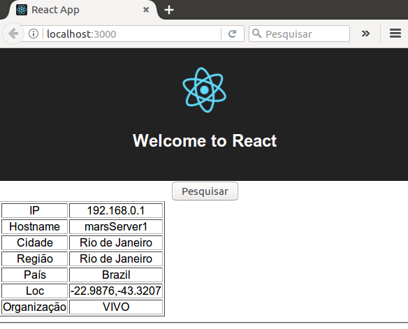

# React! Don't Panic!

## Strike two: Trabalho de "gente grande"

Ok, no nosso primeiro tutorial, vimos o “jeitão” do React e criamos uma app “maneirinha”, certo? Mas como criar um projeto de verdade? Sim, com um ciclo de desenvolvimento completo: Desenvolvimento, Teste e Exportação para Produção?

É isso que veremos agora.

### Trabalhando como gente grande

A primeira versão que fizemos foi o equivalente àquela frase que ouvíamos quando crianças: *“Senta ali no cantinho e faça um desenho bem bonito!”*

*Eita, lasqueira!* Convencemos o Chefe a usar React e ele agora quer que criemos um projeto de verdade… Calma! O pessoal do Facebook já pensou em tudo e criou uma “máquina de fazer salsicha” que gera uma app React. E não só isso: Ela cria um ciclo de desenvolvimento completo! Tudinho!

Para começar, deixe-me perguntar uma coisa: Fez o “dever de casa”? Sim, lembra que eu pedi para instalar o NodeJS e o NPM? Ah, não lembra… Tudo bem… Vamos repetir.

Prepare-se para ser “abduzido”:

1) Instale o nvm (https://github.com/creationix/nvm). Você precisa ter o NPM versão 5.2 ou superior, e o NodeJS versão 8.x;
2) Usando o NVM, instale a versão "stable" do NodeJS: nvm install 8.10.0;
3) Crie uma pasta;
4) Usando o NPX (vem com o NPM novo), digite os comandos:
```
npx create-react-app teste
cd teste
npm start
```
Agora, dê uma olhada na aplicação e examine sua estrutura. Abra a pasta "src" e veja o "App.js".

O “create-react-app” criou uma aplicação completa, que utiliza o ciclo de desenvolvimento gerido pelo “npm”. Podemos executar as fases deste ciclo de vida com os comandos: 

• **Desenvolver** (```npm start```): Executa a aplicação em modo de desenvolvimento, utilizando um servidor web NodeJS. Se os arquivos forem alterados, a página é automaticamente recarregada, para desenvolvimento interativo;
      
• **Testar** (```npm test```): Dispara um componente NodeJS chamado “Jest”, que executa sua aplicação dentro do NodeJS e não em um Navegador. Com isto, os scripts de teste podem ser executados;
      
• **Preparar para a Produção** (```npm run build```): Prepara uma versão da aplicação para ser instalada em ambiente de produção, criando uma pasta “buid”. A aplicação é compilada e os arquivos minificados, otimizados para carga rápida.


### Ok, mas o que eu faço agora?

Bom, se você já tem uma aplicação pronta, que é o nosso caso, é só modificar o arquivo “./src/App.js”, que o resto já está pronto!

Olhe como nossa app ficará: 



O trabalho é muito simples: 

    1. Separamos os dois componentes em arquivos JS: “Botao.js” e “Resultado.js”, colocando-os na pasta “src” do projeto React gerado;
    2. Dentro do arquivo “src/App.js”, inserimos a renderização do componente principal, o “Botao”;
    3. Dentro do arquivo “src/App.js”, importamos a classe “Botao”;
    4. Dentro do arquivo “src/Botao.js”, importamos a classe “Resultado”;
    5. Escrevemos casos de teste;
    6. Testamos;
    7. Fazemos o “build” final.

Dentro do meu repositório no Github (https://github.com/cleuton/ReactDontPanic) há uma pasta “fontes” com os arquivos JS modificados. É só baixar e copiar para a pasta “src” do seu projeto gerado pelo “create-react-app”.

### Separar os componentes em seus próprios arquivos

Crie dois arquivos: “Botao.js” e “Resultado.js”, copiando as respectivas classes para dentro deles. 

No início de cada arquivo, inclua esta linha, antes do código-fonte da classe respectiva: 
```
import React, { Component } from 'react';
```
E inclua esta linha final, após o código-fonte da classe respectiva: 
```
export default <nome-da-classe>;
```
Por exemplo, eis o código da classe “Botao”: 
```
import React, { Component } from 'react';

class Botao extends React.Component {
    constructor(props) {
	...
    }

    handleClick() {
	...
    }

    render() {
	...
    }
  }

export default Botao;
```

### Renderizar o componente principal dentro de “App.js”: 

Lembra de como estava o nosso arquivo “index.html”, do tutorial anterior? Havia um comando assim: 
```
ReactDOM.render(
    <Botao resultado={null} />,
    document.getElementById('root')
);    
```
Bom, isso não vai acontecer mais assim. No “esqueleto” de aplicação criado, há um arquivo “index.js” que já renderiza o componente “App” (que surpresa, não?): 
```
ReactDOM.render(<App />, document.getElementById('root'));
registerServiceWorker();
```

Então, como vamos renderizar nosso componente principal, o “Botao”? Simples! Dentro do método “render()” do componente “App”!


```
import Botao from './Botao';     // <----ESTA LINHA

class App extends Component {
  render() {
    return (
      <div className="App">
        <header className="App-header">
          
          <h1 className="App-title">Welcome to React</h1>
        </header>
        <Botao resultado={null} />   // <----E ESTA LINHA
      </div>
    );
  }
}
```
As linhas marcadas foram as que eu inseri ou alterei. Se vamos utilizar um componente novo, então temos que importá-lo dentro do código, como fazemos em outras linguagens (Java, Python etc). 

### Importar o componente filho

O componente “Botao” renderiza também o componente “Resultado”, logo, deve ser importado para dentro dele. Acrescente a linha marcada logo abaixo do primeiro “import”: 

import React, { Component } from 'react';
import Resultado from './Resultado';  // <----ESTA LINHA

class Botao extends React.Component {
...

### Iniciar a app em desenvolvimento

Para subir sua aplicação em desenvolvimento, criando um Servidor local, que escuta na porta 3000, basta rodar o comando: 
```
npm start
```
Na pasta raiz do projeto.

Uma janela de navegador se abrirá com a página. Simples e prático. Se não abrir, ou se você inadvertidamente fechar o navegador, basta abrir outra janela e digitar: “http://localhost:3000”.


### Uma nota sobre apps Frontend

O desenvolvimento de apps Web modernas é dividido em duas camadas fisicamente separadas: Frontend e Backend. Se você já trabalhou com Angular, conhece essa arquitetura. 

Todo código de conversação é executado no Frontend e o Backend é um mero fornecedor de recursos REST. 

Por isto, subimos um servidor web, em vez de abrir o arquivo HTML diretamente. 

Mas isto tem alguns problemas, como o CORS (Cross Origin Resource Sharing: https://pt.wikipedia.org/wiki/Cross-origin_resource_sharing). Eu não foi misturar os assuntos aqui, mas, se houver interesse, posso postar um artigo sobre isto.

Em resumo, sua aplicação Frontend será instalada em um Servidor Web convencional, como um Apache ou Ngix, e a sua aplicação Backend, composta por RESTful services, será servida por outro host, como um Jboss (Se for Java), IIS (.NET) ou Apache (PHP).

No nosso exemplo, o Backend já existe e pouco sabemos sobre ele. Conhecemos apenas a API. 

### Testando

Seguindo a prática de TDD (https://pt.wikipedia.org/wiki/Test_Driven_Development), o correto seria criamos scripts de teste, com vários cenários e casos de teste, ANTES de iniciarmos a codificação da nossa aplicação. A cada nova funcionalidade, podemos executar os cenários para ver se algo quebrou. 

Temos o comando: npm test, que utiliza o componente NodeJS “Jest” (https://facebook.github.io/jest/). Ele invocará os nossos scripts de teste em modo “watch” (sem abrir navegador). Poderemos ver quais testes passaram ou falharam. 

O “create-react-app” já cria um arquivo de teste para nós: “App.test.js”, que usa a sintaxe Jasmine (https://jasmine.github.io/2.0/introduction.html) para testar a aplicação: 
```
import React from 'react';
import ReactDOM from 'react-dom';
import App from './App';

it('renders without crashing', () => {
  const div = document.createElement('div');
  ReactDOM.render(<App />, div);
  ReactDOM.unmountComponentAtNode(div);
});
```
Este teste é muito simples, apenas renderiza a aplicação e espera que não resulte em erro. Se houver um erro, o Jest mostrará isso. 

Se executarmos o teste: 
```
npm test
```
Veremos o watch: 

```
 PASS  src/App.test.js  ✓ renders without crashing (24ms)

Test Suites: 1 passed, 1 total
Tests:       1 passed, 1 total
Snapshots:   0 total
Time:        0.998s, estimated 1s
Ran all test suites related to changed files.

Watch Usage
 › Press p to filter by a filename regex pattern.
 › Press t to filter by a test name regex pattern.
 › Press q to quit watch mode.
 › Press Enter to trigger a test run.
```

Eu não quero entrar no assunto de criação de casos de teste aqui, mas, para sermos levados a sério, precisamos fazer algo melhor! 

Vamos testar realmente se o botão aparece e se, ao ser clicado, a tabela aparece. São dois testes. 

Para começar, vamos instalar mais alguns componentes… Você notou que há uma pasta “node_modules” no seu projeto, não? Esta pasta contém as dependências dos componentes, baixadas pelo “npm”. Há também um arquivo de controle, chamado: “package.json”, onde todas as dependências estão listadas. 

Vamos acrescentar essas dependências: 
```
  "devDependencies": {
    "chai": "^4.1.2",
    "enzyme": "^3.3.0",
    "enzyme-adapter-react-16": "^1.1.1"
  }
```
São dependências utilizadas apenas em desenvolvimento e teste. Quando você fizer o “build”, não serão levadas para a versão final. Daí a propriedade: “devDependencies”. São 3: “chai”, “enzyme” e “enzyme-adapter-react-16”. Você pode editar o arquivo “package.json” ou então executar o comando: 
```
npm install –save-dev chai enzyme enzyme-adapter-react-16
```
O “npm” baixará as dependências, salvando-as dentro da pasta “node_modules”, e alterará o arquivo “package.json” para você.

Agora, vamos alterar o arquivo “App.test.js” para nossa nova versão: 
```
import React from 'react';
import ReactDOM from 'react-dom';
import App from './App';
import Botao from './Botao'
import ReactTestUtils from 'react-dom/test-utils'; 
import { mount } from 'enzyme';
import Adapter from 'enzyme-adapter-react-16';
import { configure } from 'enzyme';
import { expect } from 'chai';

describe('Teste da interface', () => {
  it('deve aparecer o botão Pesquisar, sem erros', () => {
    // Sem enzyme: 
    const div = document.createElement('div');
    ReactDOM.render(<App />, div);
    const buttons = div.getElementsByTagName("button");
    //console.log(buttons[0].firstChild.data);
    expect(buttons[0].firstChild.data).to.be.equal('Pesquisar');
    ReactDOM.unmountComponentAtNode(div);
  });
  
  it('Ao ser clicado, deve retornar uma tabela', () =>{
    // com enzyme:
    configure({ adapter: new Adapter() });
    const wrapper = mount(
      <Botao resultado={null} />
    );
    const botao = wrapper.find('button');
    botao.simulate('click');
    expect(wrapper.find('table')).to.have.length(1);
  });
});
```

Nossos dois testes estão incluídos em um “describe”, que separa cenários de teste. Cada “it” é um caso de teste separado. 

No primeiro caso de teste, eu usei o próprio “DOM” dos elementos para saber se foi baixado um botão HTML cujo texto é “Pesquisar”. 
```
expect(buttons[0].firstChild.data).to.be.equal('Pesquisar');
```
Se não existir o botão ou se o label for diferente de “Pesquisar”, o caso de teste falhará.

No segundo, eu utilizei o componente “enzyme” (https://github.com/airbnb/enzyme) que facilita o teste de componentes React, permitindo interagir com propriedades, métodos e eventos. 

Nós criamos uma instância de ReactWrapper que encapsula nosso Componente: 
```
    const wrapper = mount(
      <Botao resultado={null} />
    );
```
Obtemos uma referência para o elemento “button” e simulamos o clique: 
```
    const botao = wrapper.find('button');
    botao.simulate('click');
```
Depois, é só verificar se foi gerada uma “```<table>```” dentro do nosso Componente: 
```
expect(wrapper.find('table')).to.have.length(1);
```
Se você deixar executando o “npm test”, qualquer alteração será imediatamente detectada e os testes serão reexecutados.

Nesse exemplo, estamos fazendo o request GET a cada teste. Podemos “mockar” o componente, simulando o request, o que torna o teste efetivamente unitário. 

### E voilà

Passou em todos os testes? Legal! Então vamos fazer um build para instalar em “Produção”: 
```
npm run build
```
E pronto! Na pasta “build” você verá que não existe nada de React! Os Javascript estão minificados e prontos. 

O próprio “build” lhe dá uma dica para servir seu conteúdo. Se quiser mostrar a versão de produção, instale um módulo chamado “serve” (como componente Global): 
```
npm install -g serve
```
E mande rodar: 
```
serve -s build
```
Depois, aponte seu navegador para “http://localhost:5000”. 

Não é um webserver “production grade”, mas serve para gerar uma versão de integração, que pode ser acessada até na rede local. 

Bão…

Conforme prometido, neste segundo tutorial, mostrei como construir uma app de verdade,  em ambiente pré compilado, como testar e como fazer um “deploy” para produção. 

No próximo tutorial, vou criar outra app com React e Python (Flask) que deverá conter mais interações, como formulários, por exemplo. 

Até lá…

*Cleuton Sampaio, M.Sc.*
