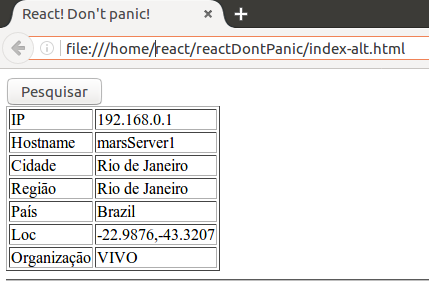

# React! Don't Panic!

## Strike one: OMG!

Conforme prometido, esse é o primeiro tutorial de desenvolvimento Web com a biblioteca React, criada pelo Facebook.

Você verá muita coisa nova, pois o moderno desenvolvimento Web, separado em “frontend” e “backend”, impõe grande mudança de perspectiva. Se você se acostumou a utilizar frameworks monolíticos, como: PHP, .NET ou JSF, provavelmente estranhará muito. Mas, se já utilizou Angular, por exemplo, já está acostumado. 

Normalmente, usamos um conjunto de ferramentas e um workflow de desenvolvimento de apps Web “frontend”. No caso do React, usamos o NodeJS, o NPM, o Webpack, o Babel e outras. E temos um workflow de desenvolvimento, teste e “build” de “frontend”. 

Há um componente free chamado “create-react-app” que facilita tudo para você: 

https://github.com/facebook/create-react-app

Porém, pode ser um pouco confuso ver tudo isso junto, então, neste primeiro tutorial, quero focar no uso do React em si, ou seja, como você desenvolve uma página com React, e não no resto, que mostrarei em outra oportunidade.


### Vamos começar por pequenas partes. 

*"Minha primeira página React"*

Ok. Vamos começar beeem devagar. Acesse o repositório no Github e baixe o projeto “ReactDontPanic”: 

https://github.com/cleuton/ReactDontPanic

Você pode clonar o repositório ou baixar um Zip. 

Entre na pasta que baixou e abra a subpasta “inicio”, dê um duplo clique no arquivo [**“index.html”**](./index.html). É uma pequena aplicação React, que vou analisar com você. 

Esta aplicação é beeem simples! Ela acessa um RESTful service disponível na rede, o “IpInfo.io” (http://ipinfo.io). Ele retorna as informações do seu endereço ip. Veja um exemplo de uso desta página: 



Inicialmente, a página mostra apenas com o botão “Pesquisar”. Ao clicar no Botão, é feito um request GET e o estado da página é atualizado, mostrando uma tabela com as informações retornadas. 


### “Zoiando” o código

Abra o arquivo “index.html” com um editor de textos (Gedit, Notepad, Visual Studio Code ou qualquer outro editor de arquivos gerais). 

Nota: Este exemplo é apenas para demonstração! Não está otimizado para Produção!. Ele invoca o compilador “Babel” (https://babeljs.io/) para compilar o código Javascript “on the fly”, incluindo as expressões JSX, o que é muito lento. No próximo artigo, mostrarei como fazer uma versão mais profissional.

Todas as bibliotecas Javascript que você precisa importar estão na seção “head”: 

```
  <head>
    <meta charset="UTF-8" />
    <title>React! Don't panic!</title>
    <script src="https://unpkg.com/react@16/umd/react.development.js"></script>
    <script src="https://unpkg.com/react-dom@16/umd/react-dom.development.js"></script>
    <script src="https://unpkg.com/babel-standalone@6.15.0/babel.min.js"></script>
  </head>
````

E o código Javascript da nossa aplicação está dentro de um único tag “```<script>```”: 

```
    <script type="text/babel">

      class Resultado extends React.Component {
              constructor(props) {
                super(props);
                this.state = {'dados' : props.dados}
              }
	...

      ReactDOM.render(
        <Botao resultado={null} />,
        document.getElementById('root')
      );    
    </script>
```
Fica bem mais fácil de entender como programar em React, não? Essa não é a melhor maneira de criar um site com React, mas é a mais fácil para começarmos. 

Nossa página é muito simples. Ela tem um botão que, ao ser clicado, faz um request AJAJ (Async Javascript And JSON) e formata a resposta como uma tabela. Simples. Só estamos trabalhando no Frontend, que vai rodar dentro do seu navegador. 

### Elementos e Componentes

O React não separa renderização de controle, ou seja, ele não força um modelo MVW, como o Angular (thanks God!). 

No Angular, a lógica de controle e a de renderização ficam em arquivos totalmente separados. No React, os conceitos são separados em componentes de baixo acoplamento que já embutem tudo o que é necessário para prover a função: manutenção de estado, eventos, preparação e renderização. 

Um componente React é autocontido e totalmente independente, podendo ser reutilizado em diversas outras aplicações. 

Customizações não precisam ser feitas em tags HTML, mas em CSS, e o React permite isso.

Um componente React utiliza Elementos (com “E” maiúsculo) para renderizar as informações. 

Recaptulando… Uma página React é criada por Componentes, que usam outros Componentes e Elementos para criar a UI.

Na nossa página, temos apenas dois componentes: “Botao” e “Resultado”. Consegue identificá-los no código? Não? Aqui estão: 

      class Botao extends React.Component {
        constructor(props) {
		...
        }

        handleClick() {
		...
        }

        render() {
		...
        }
      }

      class Resultado extends React.Component {
              constructor(props) {
			...
              }

              render() {
			...
              }
      }

São duas classes (Javascript ES6: https://googlechrome.github.io/samples/classes-es6/) derivadas de “React.Component”. Em ambas eu acrescentei um “construtor” e alguns outros métodos.  Dê uma boa olhada no código!

Ok, estes são os Componentes, e quais são os Elementos? Onde está o HTML que eu mostrei no exemplo? Calma! Procure localizar as quatro linhas finais do script, onde está este código: 
```
      ReactDOM.render(
        <Botao resultado={null} />,
        document.getElementById('root')
      );   
```
Ele está inserindo um tag “```<Botao>```” dentro de um tag cujo id é “root”, e esse tag é uma “```<div>```”, no início da página: 

```
  <body>
    <div id="root"></div>
````

Mas que raios de tag “Botao” é esse? Será que tem algo a ver com o nosso componente “Botao”? Claro que sim! Cada classe derivada de “React.Component” pode ser utilizada como Elemento HTML! Podemos renderizar Componentes, Elementos ou uma combinação de ambos!

Procure a implementação do método “render()” da classe “Resultado”: 

```
render() {
    return (
        <table border='1'>
            <tbody>
                <tr><td>IP</td><td>{this.state.dados.ip}</td></tr>
                <tr><td>Hostname</td><td>{this.state.dados.hostname}</td></tr>
                <tr><td>Cidade</td><td>{this.state.dados.city}</td></tr>
                <tr><td>Regi&atilde;o</td><td>{this.state.dados.region}</td></tr>
                <tr><td>Pa&iacute;s</td><td>{this.state.dados.country}</td></tr>
                <tr><td>Loc</td><td>{this.state.dados.loc}</td></tr>
                <tr><td>Organiza&ccedil;&atilde;o</td><td>{this.state.dados.org}</td></tr>
            </tbody>
        </table>
    )
}
```

Este método retorna um HTML. Notou algo estranho? Não? Cadê as aspas? O HTML deveria ser um string, não? O Javascript deveria dar erro! 

Isso tem a ver com o JSX (https://facebook.github.io/jsx/), que é compilado pelo Babel! 

Vamos voltar só um pouquinho… Notou que o script tag da nossa aplicação especifica um argumento “type”? Qual é ele? 

```
<script type="text/babel">...</script>
```


Sim, é “text/babel”, ou seja, o Babel vai analisar nossa página e compilar todo o código em Javascript comum. Isso também é conhecido como “transpiler” ou “source-to-source” compiler. Ele pega um fonte e gera outro. Assim, as expressões JSX também são transformadas em comandos Javascript comuns.

Então, voltando aos Componentes e Elementos, o nosso Componente “Resultado” renderiza um Elemento JSX “```<table>```”, criado dinamicamente!

Mas os componentes podem renderizar Elementos e também outros Componentes! Veja só o método “render()” do componente “Botao”: 

```
render() {
    return (
        <div>
            <button onClick={this.handleClick}>
            Pesquisar
            </button>
            {this.state.dados != null &&
            <Resultado dados={this.state.dados} />
            }
            <hr/> 
        </div>
    );
}
```

Ele renderiza uma “```<div>```”, que é um elemento JSX, que contém um “```<button>```”, outro elemento JSX, e um Componente “```<Resultado>```”, que não é um Elemento, mas também pode ser incluído em uma expressão JSX.

### Eventos

Nossa app tem que interceptar o clique do botão. Neste momento é feito um Request GET ao servidor REST. Isto é feito através de um manipulador de eventos, muito parecido com os eventos do HTML (onclick), só que, no React, os nomes dos eventos seguem o padrão “corcova de camelo”: “onClick”. Veja só: 

1 - A página HTML é carregada;

2 - O código Javascript imediato é executado:
```
ReactDOM.render(
        <Botao resultado={null} />,
        document.getElementById('root')
      );   
```

3 - O componente “```<Botao>```” é instanciado e renderizado, executando seu método “render()”:

```
        render() {
          return (
            <div>
              <button onClick={this.handleClick}>
                Pesquisar
              </button>
              {this.state.dados != null &&  // <---CONDICIONAL
                <Resultado dados={this.state.dados} />
              }
              <hr/> 
            </div>
          );
        }
```

4 - O evento “onClick” é associado ao método “handleClick()”, do Componente “Botao”;

5 - Como havia um condicional, o componente “```<Resultado>```” não será renderizado pelo componente “Botao”, pois, no início a propriedade “dados”, do estado é nula:

5.1 - Nós renderizamos o componente “Botao”, na carga da página HTML, com o parâmetro “resultado” como null: 
```
      ReactDOM.render(
        <Botao resultado={null} />,
        document.getElementById('root')
      );   
```

5.2 - O construtor do componente “Botao” inicia o estado interno (this.state) com o valor da propriedade “resultado”, que foi passada como null: 

```
      class Botao extends React.Component {
        constructor(props) {
          super(props);
          this.state = {'dados' : props.resultado};
```

5.3 - Por isto, a renderização inicial da página só apresenta o botão, e nada mais. 

6 - O usuário clica no botão, o evento é capturado e a função “this.handleClick()” é invocada:

```
        handleClick() {

          fetch('http://ipinfo.io/json'
          )
            .then(response => response.json())
            .then(rjson => {
              this.setState({'dados':rjson})
            })

        }
```

7 - Como modificamos o estado interno do componente “Botao”, ele será renderizado novamente. Desta vez, a propriedade “dados”, do seu estado, conterá um objeto JSON, logo, o condicional da renderização resultará em verdadeiro, incluindo o componente “```<Resultado>```”:

```
              {this.state.dados != null &&
                <Resultado dados={this.state.dados} />
              }
```

Não podemos mudar a aparência de um Componente já renderizado. Se for necessário, precisamos renderizá-lo novamente, e isto acontece sempre que alteramos o seu estado interno (this.setState()).

### AJAJ

Podemos usar qualquer framework para acesso assíncrono, como o Jquery, por exemplo. Mas o React oferece a API “fetch”, para consumo de informações REST: https://facebook.github.io/react-native/docs/network.html

No nosso caso, fizemos exatamente isso: 
```
          fetch('http://ipinfo.io/json'
          )
            .then(response => response.json())
            .then(rjson => {
              this.setState({'dados':rjson})
            })
```

O método “fetch()” retorna uma Promise (https://developer.mozilla.org/pt-BR/docs/Web/JavaScript/Reference/Global_Objects/Promise). Podemos passar uma função para essa Promise. O código acima está usando a sintaxe lambda do ES6, mas poderíamos reescrevê-lo assim: 

```
          fetch('http://ipinfo.io/json'
          )
            .then(function(response) {
				return response.json()
                        .then(function(rjson) {
                                 this.setstate({'dados':rjson});
                              });
			}
		 )
```

E o que acontece depois? Nós mudamos o estado interno do componente “Botao” (método “setState()”), isto forçara a recriação e renderização, logo, seu método “render()” será executado e, como agora a propriedade “dados” está preenchida, o componente “Resultado” será renderizado. 

O componente “Resultado” recebe o estado interno do componente “Botao”. Veja só como o “Botao” o renderiza: 

```
{this.state.dados != null &&
   <Resultado dados={this.state.dados} />
}
```

Como “this.state.dados”, do componente “Botao”, agora contém os resultados recebidos do “fetch()”, então será diferente de “null”, logo, o tag “```<Resultado>```” será renderizado. E ele recebe um argumento “dados”, que conterá o JSON que recebemos. 

No construtor do componente “Resultado” ele pega o argumento recebido e armazena em seu próprio estado interno: 

```
constructor(props) {
    super(props);
    this.state = {'dados' : props.dados}
}
```

Todo componente recebe um argumento “props” em seu construtor, de onde pode acessar os argumentos utilizados no Tag. 

Quando o componente “Resultado” for renderizar a tabela, ele pegará os valores que estão em seu estado interno: 

```
render() {
    return (
        <table border='1'>
            <tbody>
                <tr><td>IP</td><td>{this.state.dados.ip}</td></tr>
                <tr><td>Hostname</td><td>{this.state.dados.hostname}</td></tr>
                <tr><td>Cidade</td><td>{this.state.dados.city}</td></tr>
                <tr><td>Regi&atilde;o</td><td>{this.state.dados.region}</td></tr>
                <tr><td>Pa&iacute;s</td><td>{this.state.dados.country}</td></tr>
                <tr><td>Loc</td><td>{this.state.dados.loc}</td></tr>
                <tr><td>Organiza&ccedil;&atilde;o</td><td>{this.state.dados.org}</td></tr>
            </tbody>
        </table>
    )
}
```

Muito importante: Quando você colocar dentro de um argumento de Elemento JSX ou Componente um valor que seja Javascript, não use aspas! Use chaves “{ }”.

### O elefante é grande… Vamos comendo aos pedacinhos!

Há muito mais coisas para aprendermos a usar o React corretamente. Mas aqui, vimos os primeiros passos, e com uma app que consome um serviço REST. 

No próximo tutorial, vou mostrar como criar uma app de produção, que pré-compila o Javascript. 

**Cleuton Sampaio, M.Sc.**

