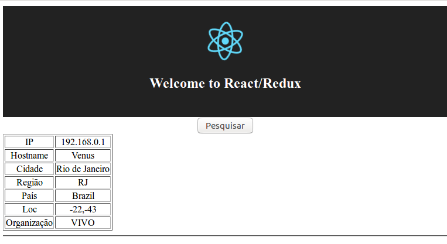

# React! Don't Panic!

[](https://www.lcm.com.br/site/#livros/busca?term=cleuton)


## Strike four: React com Redux

**Redux** é uma biblioteca para gestão de estado em aplicações Javascript. 

Só que, em torno do Redux, vários outros componentes e bibliotecas foram criados, como: 
- Redux **Form**: Um gerenciador de estado de forms usando Redux;
- Redux **Router**: Para gerenciar suas rotas de aplicação dentro de uma store do Redux;
- Redux **Dialog**: Componente para manter estado de diálogos em stores do Redux;

Podemos estender esta lista interminávelmente... Para ter uma ideia, consulte o [**ecossistema Redux**](https://redux.js.org/introduction/ecosystem).

## E o Flux? 

Bom, pode ser meio complicado de entender... Redux é uma implementação do padrão [**Flux**](https://facebook.github.io/flux/docs/overview.html)? Sim e não, de acordo com a [documentação deles](https://redux.js.org/introduction/prior-art#flux). 

O Redux foi inspirado pelo padrão arquitetural do Flux, e segue alguns de seus preceitos, como o controle centralizado de estado, mas, ao contrário do Flux, o Redux prega que os "**reducers**" sejam funções "**puras**" e que não modifiquem o estado, apenas gerem um novo objeto.

O Redux pode ser utilizado com outras bibliotecas Javascript, como [**Angular**](https://github.com/angular-redux/store) ou [**Ember**](http://www.ember-redux.com/).

## Mas eu usaria Redux para quê?

Imagine uma aplicação moderna Javascript. Imaginou? Existem vários **Componentes**, cada um com seu **Estado**, que pode ser alterado por vários **Serviços** em operações **Assíncronas**. Continou imaginando? O usuário pode executar **Ações** que, por sua vez, disparam **Eventos** e que podem alterar os **Estados** individuais dos componentes. E o ciclo se repete. 

Acabamos com o estado replicado ou fragmentado entre componentes e objetos diferentes ao longo da nossa página.

Com o Redux, temos uma **Store** que armazena nosso estado. Usamos um tipo de função especial, o **Reducer** para executar ações e gerar novo estado. Qualquer mudança de estado, terá que ser realizada por uma **Ação** documentada, e processada pelo **Reducer**. 

### Mas eu preciso MESMO usar Redux?

É verdade que nem toda aplicação **React** precisa usar o Redux. Ele acrescenta complexidade e indireção à sua já complexa aplicação React. Podemos dizer que o uso do Redux representa um *trade-off* que você deverá fazer, ou seja, acrescenta complexidade em troca de gerenciar melhor o estado e suas transições. 

Há várias discussões a respeito do uso ou não do Redux junto com o React (ou com outros frameworks frontend). Eu gosto de me apegar a uma filosofia: **Não use uma tecnologia só porque é moda**. Eis alguns artigos que falam sobre o uso do Redux junto com o React: 

- ["**You Probably Don’t Need Redux**"](https://medium.com/@blairanderson/you-probably-dont-need-redux-1b404204a07f) (Você provavelmente não precisa do Redux);
- ["**When to use Redux**"](https://medium.com/@fastphrase/when-to-use-redux-f0aa70b5b1e2) (Quando utilizar o Redux);
- ["**You Might Not Need Redux**"](https://medium.com/@dan_abramov/you-might-not-need-redux-be46360cf367) (Você pode não precisar do Redux).

Algumas das razões para usar Redux: 

1. Você tem um estado compartilhado com muitos componentes, como estado de conversação ou sessão;
2. Você tem componentes globais que se repetem em várias partes da sua UI, como Tabs por exemplo;
3. Há muitas propriedades (props) sendo passadas por toda uma hierarquia de componentes;
4. O usuário pode sair e voltar para sua aplicação e você precisa guardar o estado.

Geralmente, aplicações de interações simples, como esta que vou mostrar, não precisam nem do React, quanto mais do Redux. 

## Antes de começar

Você pode criar uma app com o npx, como eu ensinei em [**Trabalhando como gente grande**](../fontes) ou pode usar a app que você já criou. Depois, instale o Redux e algumas "cositas" mais: 
```
npm install --save redux
npm install --save react-redux
npm install --save redux-thunk
```

## Principais mudanças na aplicação para usar Redux

A aplicação que vou demonstrar é a mesma que venho utilizando desde o início. Ela busca as informações relativas ao seu Endereço IP.



Para começar, precisamos transformar nosso estado em um script Json. Precisamos poder "escriptar" nosso estado. No meu caso, o estado pode ser reduzido a isto: 

```
{
    aguardando: true/false,
    dados: {dados sobre o endereço IP}
}
```

Não me interessa detalhar o estado da propriedade "dados", já que ela é utilizada apenas por um único componente React ([**Resultado.js**](./src/Resultado.js)).

### Vamos criar ações

Minha aplicação vai trabalhar com requisição assíncrona, através de XmlHttpRequest, portanto, manda a boa prática que eu tenha duas ações: Uma para iniciar o request e outra para quando os resultados chegarem.

O arquivo [**Actions.js**](./src/Actions.js) contém as definições das minhas ações e os "*action creators*".

Se examinar o arquivo, verá que só estou exportando os nomes das ações e uma função chamada "fetchIp()", que invoca as duas ações em tempos diferentes. Não estou exportando as duas ações individuais. 

Todo **Action creator** Redux precisa retornar um objeto simples, com uma propriedade **Type**. É isto que as funções "requestIp()" e "receiveIp()" fazem. Já a função "fetchIp()" se parece com um Action creator, mas ela retorna uma **function**!!! Isso está errado!

### Thunk actions

Segundo a Wikipedia, [**Thunk**](https://en.wikipedia.org/wiki/Thunk) é uma subrotina que "injeta" código em outra subrotina, por exemplo, para processar o resultado de operações assíncronas. Para processar operações assíncronas com o Redux, eu preciso criar uma **Thunk action**, e, para isto, preciso do *Middleware* [**redux-thunk**](https://github.com/gaearon/redux-thunk).

Para instalar o *Middleware* basta abrir a pasta do projeto, depois de rodar ```npm install``` e digitar: 
```
npm install --save redux-thunk
```
Depois, precisamos alterar o arquivo [**index.js**](./src/index.js) para adicionar o *Middleware*: 
```
import { createStore, applyMiddleware } from 'redux';
import thunk from 'redux-thunk';
...
... applyMiddleware(thunk)
```

Como podem ver no código, a função "fetchIp()" é um **Thunk Action Creator** e ela invoca as duas outras ações: "requestIp()" e "receiveIp()", em dois momentos diferentes, utilizando o objeto "**dispatch**":
```
export function fetchIp() {
    return function (dispatch) {
        console.log('invoked!!!')
        dispatch(requestIp())
        console.log('fetching...')
        return fetch(url)
          .then(
            response => response.json(),
            error => console.log('An error occurred.', error)
          )
          .then(json => {
                console.log('again! ' + JSON.stringify(json))
                dispatch(receiveIp(json))
            }
          )
      }
}
```

### Reducer

O **Reducer** é o *coração* do Redux! Ele processa as ações e gera o novo estado baseado nelas. O arquivo [**Reducer.js**](./src/Reducer.js) define o nosso reducer. Na verdade, você pode ter mais de um reducer e depois combiná-los em um "*root reducer*". Para facilitar, eis o código do Reducer: 

```
import {
    REQUEST_IP,
    RECEIVE_IP
  } from './Actions'

const estadoInicial = {
    aguardando: false,
    dados: null
};

function atualizarDados(state = estadoInicial, action) {
    switch(action.type) {
        case REQUEST_IP: 
            return Object.assign({}, state, {
                    aguardando: true,
                    dados: null
                } 
            )
        case RECEIVE_IP: 
            return Object.assign({}, state, {
                aguardando: false,
                dados: action.dados
            })
        default: 
            return state;
    }
}

export default atualizarDados;
```

A função "atualizarDados()" é o meu reducer. Ela recebe um **Estado** e uma **Ação** e retorna um **Novo estado**. Reducers devem ser [**Pure functions**](https://en.wikipedia.org/wiki/Pure_function), ou seja: 
- Dados os mesmos argumentos, deve retornar sempre os mesmos valores (uso de números aleatórios ou de informação de tempo não é possível);
- Não produz efeitos colaterais (não deve sequer logar informações);

Um reducer pode receber um estado inicial (graças à característica de valor default para parâmetros). Se nenhuma ação foi informada, então deve simplesmente retornar o estado que recebeu. 

**Object.assign()**

Este método serve para copiar as propriedades enumeráveis de um ou mais objetos origem, para um novo objeto destino. 

### Criando a store

No Redux, mantemos nosso estado em uma **Store**. Ela deve ser instanciada no arquivo [**index.js**](./src/index.js) da aplicação: 
```
import { Provider } from 'react-redux';
import atualizarDados from './Reducer';


const store = createStore(atualizarDados,
    applyMiddleware(thunk));
```
Não só criamos a instância da **Store** como também aplicamos o nosso *Middleware* **Thunk**. 

Para que os componentes tenham acesso à **Store** precisamos "embrulhar" nosso componente principal, [**App**](./src/App.js) em um Componente **Provider**: 

```
import { Provider } from 'react-redux';
import App from './App';

render(
    <Provider store={store}>
        <App />
    </Provider>,
    document.getElementById('root')
);
```

### Componentes Container e Presentation

O Redux introduz um padrão de projeto que consiste em separar os componentes em **Container** e **Presentation**. De acordo com a [**documentação**](https://redux.js.org/basics/usage-with-react#presentational-and-container-components) do Redux, o componente **Container** se preocupa em COMO as coisas funcionarão, e está ciente do Redux, sendo um "listener" da **Store**. Ele dispara as ações e repassa partes do **Estado** para os componentes **Presentation**. 

Um componente **Presentation** se preocupa com a APARÊNCIA das coisas, e não está ciente do Redux. Ele recebe dados através de **props** e também recebe **Callbacks** através delas. Ele não interage com o Redux e nem com a **Store**. Qualquer estado interno que ele mantenha, tem que ser derivado do que ele recebeu do **Container**.

Eu tive que separar o meu componente original *App* em dois. Criei um componente **Container** ([Container.js](./src/Container.js)) e esse é o componente que eu uso dentro de [**App.js**](./src/App.js), o componente principal da minha aplicação, que é renderizado dentro do [**index.js**](./src/index.js). 

Meu componente **Container** tem que fazer algumas "coisinhas" especiais, por exemplo, se conectar à **Store** e mapear o estado e as ações em propriedades, para os componentes **Presentation**. Eis o código-fonte: 
```
import { connect } from 'react-redux'
import { fetchIp } from './Actions'
import Presentational from './Presentational'

const mapStateToProps = state => (
  {dados: state.dados}
);

const mapDispatchToProps = dispatch => ({
  clickBotao: () => dispatch(fetchIp())
})

export default connect(
  mapStateToProps,
  mapDispatchToProps
)(Presentational)

```
Ele não retorna nenhuma expressão **JSX**, já que esse papel é dos componentes **Presentation**. Ele usa a função "connect()", do **react-redux** para retornar um objeto conectado à **Store**. E eu passo alguns argumentos importantes: 
- A lista de propriedades que os componentes receberão (mapeada a partir do **Estado**);
- A lista de *callbacks* que os componentes receberão;
- O nome do componente principal **Presentation**.

### Componentes de apresentação

Eu criei um componente [**Presentational.js**](./src/Presentational.js) para abrigar os componentes de apresentação, como o [**Botao.js**](./src/Botao.js) por exemplo.
```
import React from 'react';
import logo from './logo.svg';
import './App.css';
import Botao from './Botao';

const Presentational = (props) => {
  console.log('Presentational props: ' + JSON.stringify(props));
  return (
  <div className="App">
    <header className="App-header">
      
      <h1 className="App-title">Welcome to React/Redux</h1>
    </header>
    <Botao dados={props.dados} click={props.clickBotao} />
  </div>)
}

export default Presentational;
```
Eu usei a sintaxe de **Função** (em vez de **Classe**) para criar o componente. Já que eu não precisarei armazenar estado interno, posso simplificar as coisas. Ficou confuso? Ele poderia ser reescrito assim: 
```
function Presentational(props) {
    ...
}
```
O que há de diferente nesse Componente? Ah, sim! Eu "puxei" o *event handler* **onClick** para o componente **Botao**. Isso é para associá-lo à função que o **mapDispatchToProps** do [**Container.js**](./src/Container.js) passar para ele. Eu recebo os **dados** e o **clickBotao** dentro das **props** e associo aos componentes de apresentação filhos. 

Eu também tive que alterar o componente[**Botao.js**](./src/Botao.js) para transformá-lo em **Function**. Isso facilita muito para receber o tratamento de eventos e os dados. Note que ambos, **Presentational** e **Botao** não estão cientes do **Redux**.

Eis o código do componente: 
```
import React, { Component } from 'react';
import Resultado from './Resultado';

const Botao = ({dados,click}) => (
  <div>
    <button onClick={click}>
      Pesquisar
    </button>
    {dados != null &&
      <Resultado dados={dados} />
    }
    <hr/> 
  </div>
);

export default Botao;
```

### Fluxo

Quando a página é renderizada, o **Reducer** é invocado com o **Estado inicial**. Então, o componente **Container** é renderizado e retorna um componente **Presentational** ligado à nossa **Store**. Como a propriedade **dados** do **Estado** é nula, o componente **Resultado** não é renderizado, conforme podemos ver no código do componente **Botao**.

Ao clicarmos no **Botao** o **event handler onClick** é invocado. O tratamento está no componente **Container**: 
```
const mapDispatchToProps = dispatch => ({
  clickBotao: () => dispatch(fetchIp())
})
```
A ação **thunk** "fetchIp()" é invocada,e fará duas alterações no **Estado**: REQUEST_IP e depois RECEIVE_IP. 

Ao processar a RECEIVE_IP, o retorno da função "receiveIp()" será um novo **Estado**, que será armazenado na **Store**, de onde o **Container** pega os **dados** e mapeia às **props** do componente **Presentational**.

Confuso? Estude este fluxo novamente para entender. 

### Modificações no teste

Eu tive que fazer algumas modificações no script de teste [**App.test.js**](./src/App.test.js) para torná-lo compatível com o *Middleware* **redux-thunk**. 

Tive que acrecentar os mesmos imports que eu tinha no [**index.js**](./src/index.js): 
```
import { Provider } from 'react-redux';
import thunk from 'redux-thunk';
import { createStore, applyMiddleware } from 'redux';
import atualizarDados from './Reducer';
```
Tive que criar a **Store** e aplicar o *Middleware* **thunk** no primeiro teste: 
```
    const store = createStore(atualizarDados,
      applyMiddleware(thunk));
      
    const div = document.createElement('div');
    ReactDOM.render(
      <Provider store={store}>
        <App />
      </Provider>      
      , div);
```

### Conclusão

Este exemplo é muito simples para demonstrar o potencial do Redux e, na verdade, nem seria necessário utilizar Redux com ele, mas creio que serve para demonstrar bem o seu uso. 


