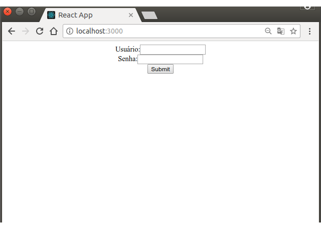
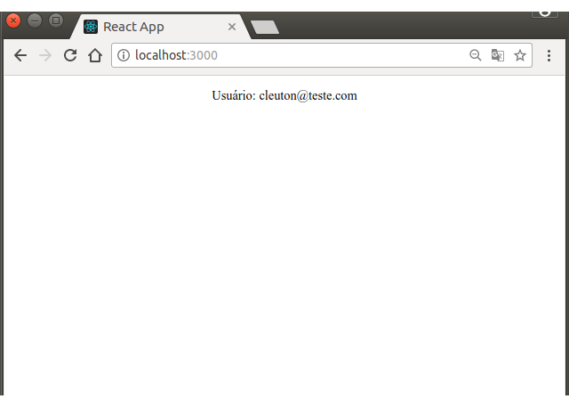

# React! Don't Panic!
(c) 2018 [**Cleuton Sampaio**](https://github.com/cleuton).


## Strike five: Formulários com Redux-form!

Fala sério! Você ficou aí, coçando a cabeça pensando nisso, não? *"Como é que eu vou fazer um form?"* Ae, você não está só! Eu também fiquei meio perdido, no meio dessa **selva** de frameworks, padrões, componentes etc.

É aí que entra o **Redux-form**! Existem outras soluções para tratamento de forms com React, como o [**Flux-form**](https://github.com/goatslacker/flux-form), porém, já que eu mostrei o **Redux** para gerenciamento de estado, faz todo sentido mostrar o **Redux-form**, não? Muita gente o utiliza com sucesso. 

## Vamos lá...

A aplicação que vou mostrar é muuuuiiiiito simples. Por que? Bem, esses frameworks já são complicados o suficiente, logo, temos que "comer o elefante pelas beiradas". 

É uma SPA (Single Page Application) que possui dois "estados": Antes do login, quando apresenta o form para o usuário se autenticar: 



E depois do login, quando apresenta o nome do usuário logado: 



A decisão se vai mostrar o **form** ou o **nome do usuário** é tomada no componente [**Presentational.js**](./src/Presentational.js):
```
  <div className="App">
    {
      props.dados != null &&
      <p>Usuário: {props.dados.user} </p>
    }
    {
      props.dados == null &&
      <LoginForm onSubmit={submit} />
    }    
  </div>
```

Crie uma aplicação nova com o **create-react-app**:
```
npx create-react-app redux_form
cd redux_form
```
Vamos criar uma app simples, com um form de **login**. E vamos usar um servidor **python** utilizando o framework **Flask** para criar um **Microsserviço** para processar o request! Crie aí o código do servidor, que é bem simples: 
```
from flask import Flask
from flask_cors import CORS
from flask import request
app = Flask(__name__)
CORS(app)
@app.route('/', methods=['POST'])
def logon():
    return '{"user": "' + request.form['usuario'] + '","status":"autenticado"}';
```
Salve essa *poronga* como **authserver.py**. Para executar, você precisará ter o **python** 3.3 ou superior e algumas outras "cositas". Sabe instalar o **python**? Não!?

:-O

Bem, ninguém é perfeito! Siga esse [**meu tutorial do pythondrops.com**](https://github.com/cleuton/pythondrops/tree/master/virtual_environment). Ative o ambiente virtual e vamos embora!

Bom, para subir esse servidor, você precisa também ter o **flask** instalado, então, digite o comando abaixo, dentro do seu ambiente virtual: 
```
pip install Flask
pip install -U flask-cors
```
E depois, suba o servidor com: 
```
FLASK_APP=authserver.py flask run
```
Para testar se o servidor está funcionando, use o **curl**: 
```
$ curl -F 'usuario=fulano@teste.com' -F 'senha=teste' http://localhost:5000

{"user": "fulano@teste.com","status":"autenticado"}
```
Maneiro, não? Ah, não achou? então faça em **Java**! 

## Agora, vamos criar a app!

### Instações posteriores

Precisamos instalar o **redux**, o **react-redux** e o **redux-thunk**. Além disto, eu gosto muito de usar o **chai** e o **enzyme** para testes. Então, rode os seguintes comandos na pasta do projeto: 
```
npm install --save redux react-redux redux-thunk redux-form cross-fetch 
npm install --save-dev chai enzyme enzyme-adapter-react-16
```
### Actions

Bom, como temos um request assíncrono, vamos seguir aquela "receita de bolo" que fizemos no [**tutorial anterior**](../react_redux). Crie um arquivo **Actions.js** assim: 
```
import fetch from 'cross-fetch';
export const REQUEST_LOGIN = 'REQUEST_LOGIN';
export const RECEIVE_LOGIN = 'RECEIVE_LOGIN';

// Action creators:

function requestLogin() {
    return {
        type: REQUEST_LOGIN
    }
}

function receiveLogin(rjson) {
    return {
        type: RECEIVE_LOGIN,
        dados: rjson
    }
}

// Thunk action:

const url = 'http://localhost:5000';

export function fetchLogin(usuario,senha) {
    return function (dispatch) {
        console.log('invoked!!!')
        dispatch(requestLogin())
        console.log('fetching...'+usuario+','+senha)
        var form = [];
        form.push('usuario='+usuario)
        form.push('senha='+senha)
        return fetch(url,{
            'method': 'POST',
            'headers': {
                'Accept': 'application/json, application/xml, text/play, text/html, *.*',
                'Content-Type': 'application/x-www-form-urlencoded; charset=utf-8'
            },
            'body': form.join('&')         
        })
          .then(
            response => response.json(),
            error => console.log('An error occurred.', error)
          )
          .then(json => {
                console.log('again! ' + JSON.stringify(json))
                dispatch(receiveLogin(json))
            }
          )
      }
}
```

Temos uma **thunk-action** para efetuar o login. E, por falar nisso, precisamos instalar o *Middleware*! Vamos fazer isso quando criarmos nossa **store**.

### Reducer

O nosso reducer é praticamente a mesma coisa, já que a maioria do código é **boilerplate**. O **State** é composto por uma propriedade **aguardando**, que podemos usar para exibir uma animação, e uma propriedade **dados**, que receberá o JSON resultante do request.

Veja o arquivo [**Reducer.js**](./src/Reducer.js).

### Store

Agora é que ficará interessante! Vamos alterar o arquivo [**index.js**](./src/index.js) para criar nossa **Store** e nosso componente **Container**.
```
import React from 'react';
import { render } from 'react-dom';
import { createStore, applyMiddleware, combineReducers } from 'redux';
import { reducer as formReducer } from 'redux-form';
import { Provider } from 'react-redux';
import App from './App';
import atualizarDados from './Reducer';
import thunk from 'redux-thunk';

const rootReducer = combineReducers({
    estado: atualizarDados,
    form: formReducer
});
  
const store = createStore(rootReducer,
    applyMiddleware(thunk));

render(
    <Provider store={store}>
        <App />
    </Provider>,
    document.getElementById('root')
);


```
Para usar o **Redux-form** preciso usar o reducer especializado dele: *formReducer*. Só que eu também tenho meu próprio estado, além do estado do form, logo, tenho meu próprio reducer.

Por isto, eu usei o método **combineReducers()** para criar um **rootReducer**, que combina o meu próprio reducer e o formReducer, do **Redux-form**.

O meu reducer [**Reducer.js**](./src/Reducer.js) é praticamente igual ao do exempo anterior, logo, nem vou desperdiçar seu tempo falando dele. 

### Componentes

Eu tenho um componente superior [**App.js**](./src/App.js) que simplesmente renderiza o meu componente container: 
```
class App extends Component {
  render() {
    return (
      <Container />
    );
  }
}
```
O componente container, cujo nome é [**Container.js**](./src/Container.js) serve para conectar o Redux com os outros componentes de apresentação. Ele se conecta à **Store** e usa a função **connect()** para obter o estado e repassar aos componentes de apresentação como **props**: 
```
const mapStateToProps = state => {
  return {dados: state.estado.dados}
};

const mapDispatchToProps = dispatch => ({
  procsubmit: (values) => {
    console.log("Dispatch: " + values)
    dispatch(fetchLogin(values.usuario,values.senha))
  }
})

export default connect(mapStateToProps, mapDispatchToProps)(Presentational);
```

Vamos falar um pouco sobre o **mapDispatchToProps**. Ele serve para mapear o disparo de **Actions** do Redux. Eu criei uma função **procsubmit()** que recebe um objeto vindo do evento **onSubmit** do meu **Form**. Através deste objeto, eu tenho acesso aos valores dos campos do formulário, e posso disparar a ação **fetchLogin()**, que é uma **Thunk action**. Eu passo o que o usuário digitou (usuário e senha).

Para organizar os componentes de apresentação, criei um componente organizador chamado: [**Presentational.js**](./src/Presentational.js): 
```
const Presentational = (props) => {
  const { procsubmit } = props
  const submit = values => {procsubmit(values)}
  console.log("Pres:"+JSON.stringify(props.dados))
  return (
  <div className="App">
    {
      props.dados != null &&
      <p>Usuário: {props.dados.user} </p>
    }
    {
      props.dados == null &&
      <LoginForm onSubmit={submit} />
    }    
  </div>)
}

export default Presentational;
```
O que ele faz? Bem, ele renderiza o form ou o nome do usuário, dependendo do estado da aplicação. Ele não tem consciência do Redux, logo, recebe o estado como **props**. Ele recebe a função que eu dispachei com o **mapDispatchToProps** e associa a um tratador de evento local, passando isto para o componente do formulário.

Um comando interessante é este: 
```
const { procsubmit } = props
```
Ele é do ES6 um [**Desestructuring assignment**](https://developer.mozilla.org/en-US/docs/Web/JavaScript/Reference/Operators/Destructuring_assignment) que procura uma propriedade com o mesmo nome dentro de **props** e a associa a este objeto. 

Ok, finalmente, tenho o componente de formulário: [**LoginForm.js**](./src/LoginForm.js): 
```
let LoginForm = props => {
  const { handleSubmit } = props
  return (
  <div>
    <form onSubmit={handleSubmit}>
        <div>
            <div>
                <label htmlFor="usuario">Usuário:</label>
                <Field name="usuario" component="input" type="text" />
            </div>
            <div>
                <label htmlFor="senha">Senha:</label>
                <Field name="senha" component="input" type="password" />
            </div>
            <button type="submit">Submit</button>  
        </div>
    </form>
  </div>
)
}

export default reduxForm({
    form: 'login'
})(LoginForm)
```
Ele recebe o handler da função de tratamento de submit, oriundo do **Presentational** e repassa no evento **onSubmit** do form. E ele "empacota" os componentes de form dentro de componentes **Field**. 

Por fim, temos que encapsular o LoginForm, decorando-o com a função **reduxForm()**. Esta função, assim como a **conect()** são **HOCs** ou [**High Order Components**](https://reactjs.org/docs/higher-order-components.html), que "decoram" ou "encapsulam" componentes, retornando novos componentes. 

Todos os eventos de form (onFocus, onBlur etc) são tratados pelo Redux-form através desse HOC ("reduxForm()").

### Combinando estado de app com estado do form

Naturalmente, você possui estado da app, como o nome do usuário logado, por exemplo, e estado que é local ao form (conteúdo de campos). Cada **reducer** trata de um estado específico. O mais importante é separar em componentes **Container** e componentes de **Apresentação**, sendo que, estes últimos, recebem o estado somente através de **props**.

Só para terminar, desta vez eu não criei um teste detalhado, mas você pode aproveitar o arquivo [**App.test.js**](./src/App.test.js) e fazer isto! Veja o tutorial anterior. 